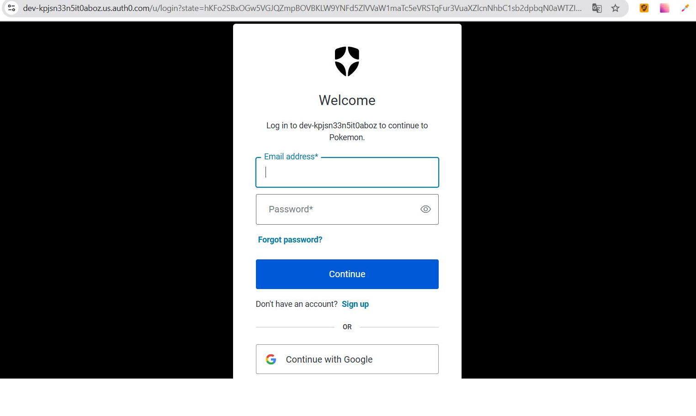
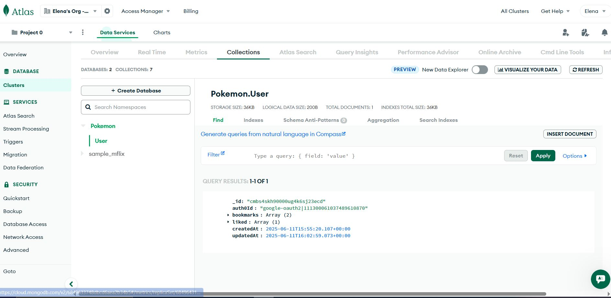
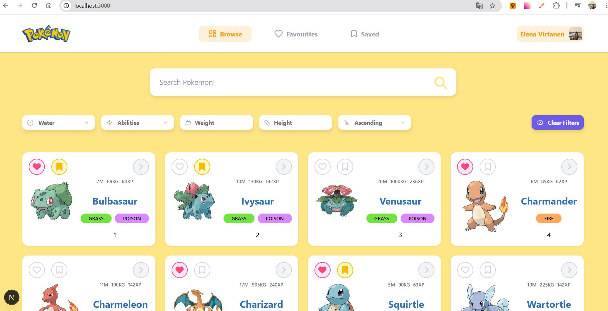
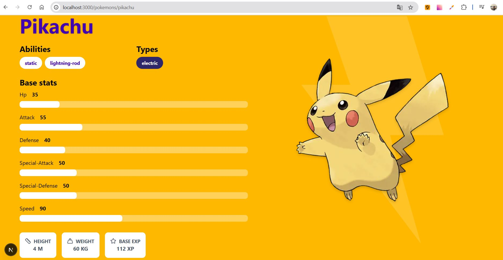
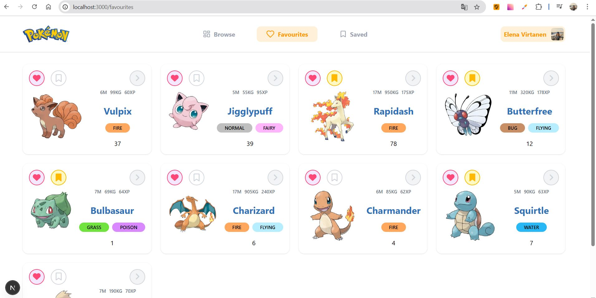
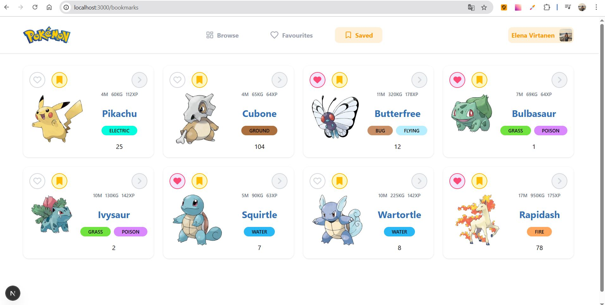

# Pokemons (React + Next.js Fullstack)
[Посмотреть демо на Netlify (стабильно работает с VPN)](https://virtanen-pokemon-next-ts.netlify.app/)

## 📚 Описание
Это SSR-приложение, разработанное с использованием **React**, **Next.js** и **TypeScript**, которое отображает список покемонов, полученных с открытого [Pokemon API](https://pokeapi.co/)  
Пользователи могут регистрироваться, логиниться, искать и фильтровать покемонов, просматривать детальную информацию о конкретном покемоне, а также добавлять их в "любимые" и "избранное".

## 🔐 Авторизация (нужен VPN)
* Используется **Auth0** (форма входа + социальные сети).
* Бесплатный тариф активен **в течение 22 дней**.
* После входа сохраняется информация о пользователе (email, имя, любимые/избранные покемоны) в MongoDB.
* Для корректной работы может понадобиться vpn.

## 🚀 Функциональность
* **Список покемонов** — по 20 карточек с возможностью подгрузки ещё.
* **Добавление в "любимые"** и **в "избранное"**.
* **Поиск по имени** с debounce (lodash).
* **Фильтрация и сортировка**:
  - по росту, весу, типу, способностям;
  - сортировка по имени (A-Z, Z-A).
* **Страница покемона** — полная информация по выбранному покемону.
* **Адаптивный дизайн** — приложение удобно на любых устройствах.

## 🖼️ Скриншоты
### 🔐 Авторизация через Auth0


### ☁️ MongoDB Atlas — сохранение данных


### 🏠 Главная страница со списком покемонов
 

### 📄 Страница конкретного покемона
 

### ❤️ Страница "Любимые покемоны"
 

### ⭐️ Страница "Сохраненные в закладках покемоны"
 

## 🛠️ Используемые технологии
- **React + Next.js (SSR)**
- **TypeScript**
- **TailwindCSS + Shadcn + Lucide-React** — UI и иконки
- **Axios** — HTTP-запросы
- **Auth0** — авторизация
- **MongoDB Atlas + Prisma** — база данных
- **Lodash** — дебаунс поиска

## 🚀 Установка и запуск
**Локально**
1. Клонируйте репозиторий:
   git clone https://github.com/HelenVirtanen/pokemon-react-ts-next
2. Перейдите в папку проекта:
   cd pokemon-react-ts-next
3. Установите зависимости: 
   npm i
4. Запустите приложение:
   npm run start
   
Приложение будет доступно по адресу http://localhost:3000

**Для разработки**
```bash
npm run dev
# or
yarn dev
# or
pnpm dev
# or
bun dev
```

## 📚 Полезные ссылки
- [Pokemon API](https://pokeapi.co/)
- [Next.js Documentation](https://nextjs.org/docs) 
- [Learn Next.js](https://nextjs.org/learn)
- [Next.js GitHub repository](https://github.com/vercel/next.js)
- [`next/font`](https://nextjs.org/docs/app/building-your-application/optimizing/fonts) 

## ☁️ Деплой на Netlify и Vercel
[Netlify Docs](https://docs.netlify.com/)
[Netlify Environment variables](https://docs.netlify.com/environment-variables/overview/)
[Vercel Platform](https://vercel.com/new?utm_medium=default-template&filter=next.js&utm_source=create-next-app&utm_campaign=create-next-app-readme)
[Next.js deployment documentation](https://nextjs.org/docs/app/building-your-application/deploying)
[Geist](https://vercel.com/font)
